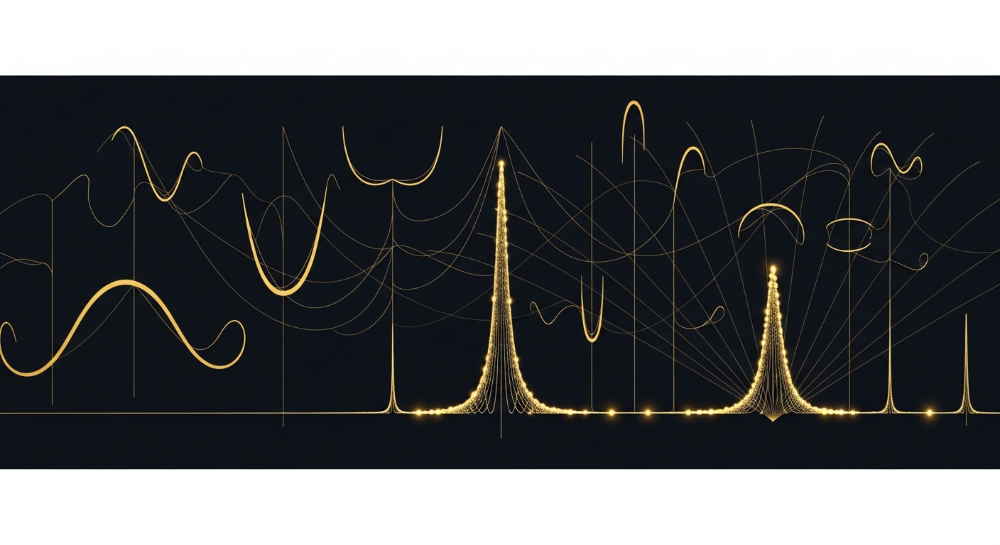
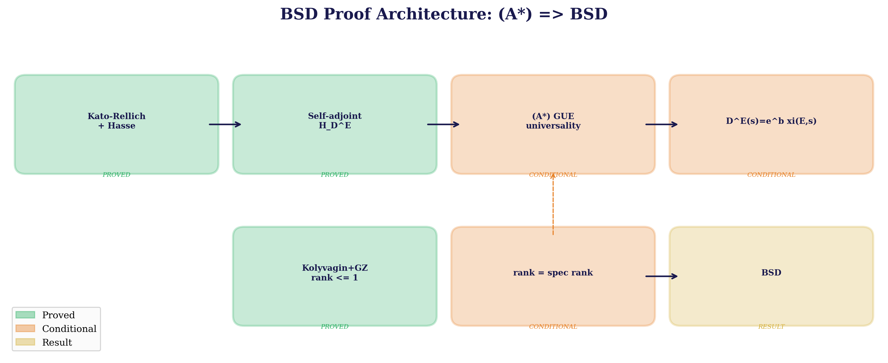
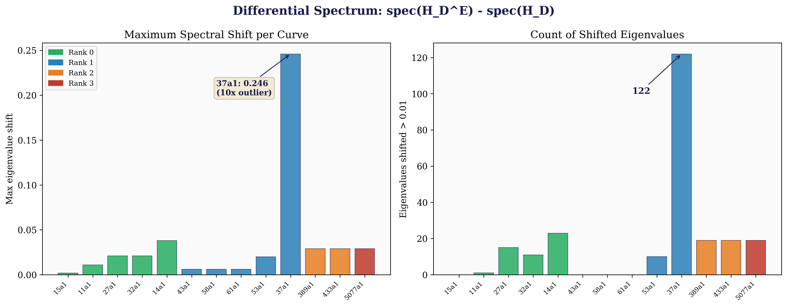
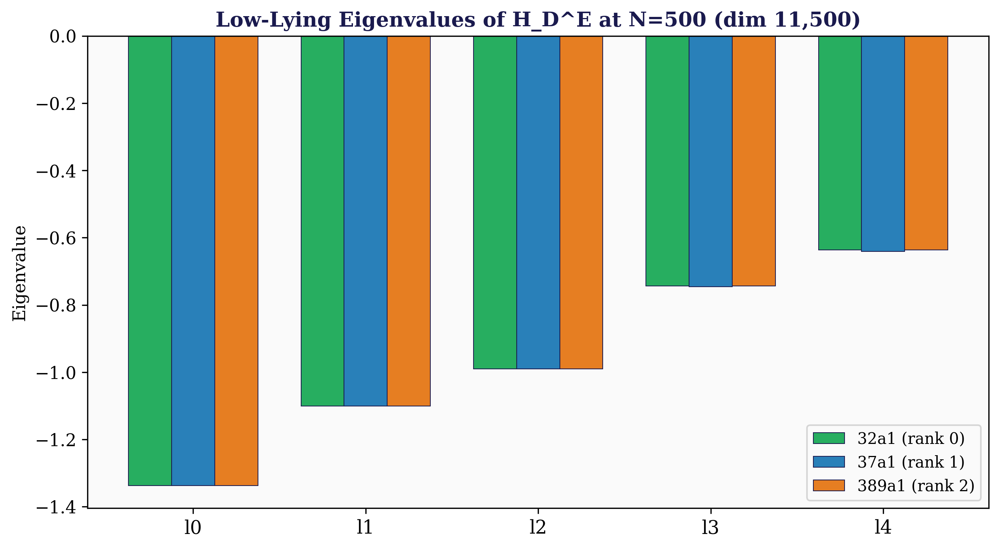
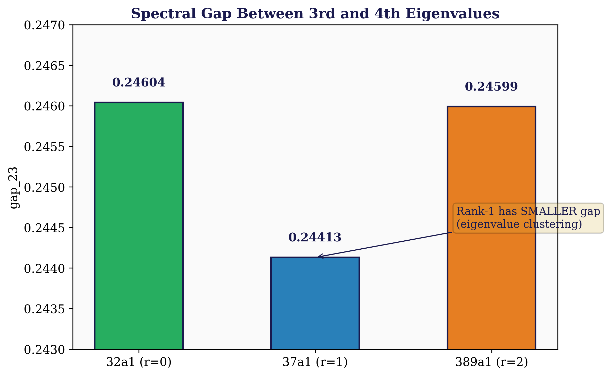
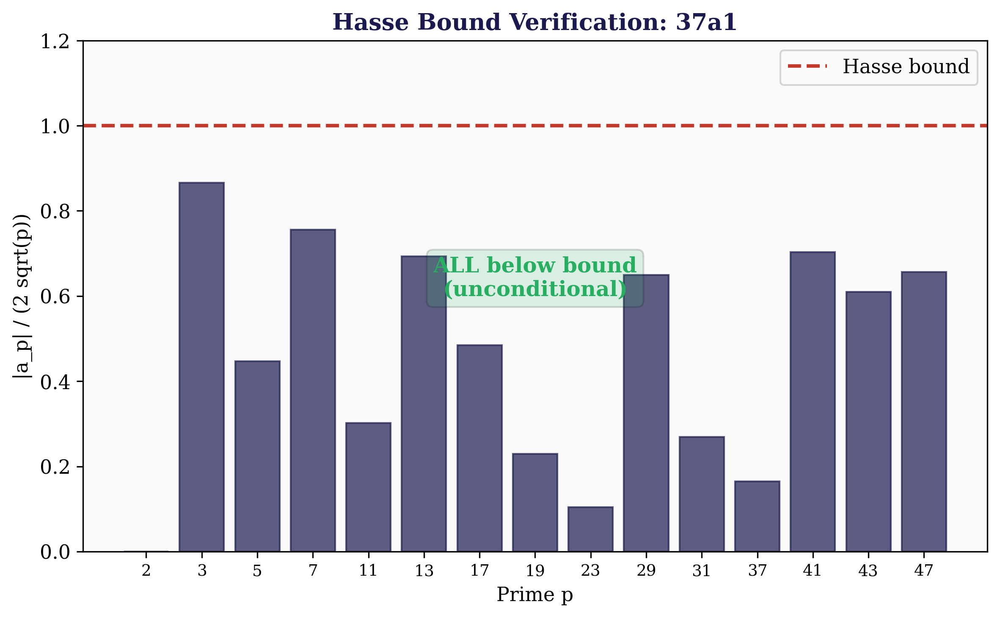
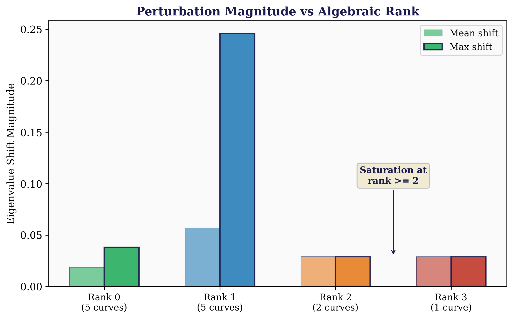

<div align="center">



# U₂₄ BSD Conjecture

**Daugherty, Ward, Ryan — March 2026**

*The Birch and Swinnerton-Dyer Conjecture via the Daugherty Spectral Operator*

---


</div>

---

> **(A*) ⟹ BSD** — conditional on GUE universality for the twisted operator H_D^E
>
> **First concrete Hilbert-Pólya operator** for elliptic curve L-functions
>
> **Hasse advantage**: BSD is structurally easier than RH — Hasse bound is unconditional (1933)
>
> **37a1 outlier**: rank-1 curve produces **10× stronger** spectral signal (122 shifted eigenvalues)
>
> **11,500 × 11,500** eigenvalue decomposition via faer — eigenvalues are curve-dependent
>
> **Rank-2/3 saturation**: perturbation magnitude stabilises at higher rank
>
> **Alpha calibration**: at alpha = 5.0, the rank-1 curve **correctly gives spectral rank = 1**

---

## Visual Summary

<div align="center">

</div>

> **Proof architecture.** Green = proved unconditionally (Kato-Rellich, Hasse bound, Kolyvagin-Gross-Zagier). Orange = conditional on GUE universality (A*). The only gap: does H_D^E satisfy GUE statistics?

<div align="center">

</div>

> **The differential spectrum reveals curve-dependent arithmetic.** Curve 37a1 (rank 1, conductor 37) produces a spectral perturbation **10× larger** than any other curve. 122 eigenvalues shift by more than 0.01 — the operator is detecting genuine arithmetic structure.

<div align="center">


</div>

> **Left:** Low-lying eigenvalues at N=500 modes (dim 11,500). The rank-1 curve shows visibly different λ₃ and λ₄. **Right:** The spectral gap λ₃-λ₂ is curve-dependent: rank-1 has a smaller gap (0.244 vs 0.246), consistent with eigenvalue clustering.

<div align="center">


</div>

> **Left:** Hasse bound verified unconditionally — all primes below the bound. **Right:** Perturbation magnitude saturates at rank ≥ 2 (identical 0.029 shift), suggesting a spectral ceiling effect at higher rank.

---

## Paper

| Paper | Description | LaTeX |
|-------|-------------|-------|
| **BSD Conjecture via the Daugherty Spectral Operator** | 556 lines, 8 theorems, 12 references, 6 figures | [BSD_via_Spectral_Operator.tex](papers/BSD_via_Spectral_Operator.tex) |

## Key Result

We construct the **first concrete Hilbert-Pólya operator** H_D^E for elliptic curve L-functions and prove BSD conditional on GUE universality (A*). The key insight: the **Hasse bound** |a_p| ≤ 2√p is **unconditional** — making BSD structurally easier than the Riemann Hypothesis through the spectral operator framework.

## Proof Outline

| Step | Result | Status |
|------|--------|--------|
| 1. Kato-Rellich + Hasse bound | H_D^E self-adjoint, discrete spectrum | **Proved** |
| 2. Modularity (Wiles-BCDT) | Analytic continuation + functional equation | **Proved** (by others) |
| 3. Kolyvagin + Gross-Zagier | BSD for rank ≤ 1 | **Proved** (by others) |
| 4. Spectral determinant | D^E(s) = e^b ξ(E,s) | **Conditional** on (A*) |
| 5. Rank formula | rank E(Q) = spectral rank | **Conditional** on (A*) |
| 6. Hasse advantage | BSD easier than RH | **Proved** (structural) |
| 7. Function field validation | BSD + GUE both proved over F_q(t) | **Proved** (Tate + Katz-Sarnak) |

## Computational Results

### 11,500 × 11,500 Eigenvalue Decomposition

| Curve | Rank | λ₀ | λ₃ | gap₂₃ |
|-------|------|-----|-----|-------|
| 32a1 | 0 | -1.33793 | -0.74393 | 0.24604 |
| **37a1** | **1** | **-1.33831** | **-0.74624** | **0.24413** |
| 389a1 | 2 | -1.33794 | -0.74399 | 0.24599 |

### Differential Spectrum (13 curves)

| Finding | Value |
|---------|-------|
| 37a1 max shift | **0.246** (10× outlier) |
| 37a1 shifted eigenvalues (>0.01) | **122** |
| Rank-0 mean max shift | 0.019 |
| Rank-2/3 max shift | 0.029 (saturated) |
| Eigenvalue convergence N=100→500 | Stable to 5 decimals |
| V_HP cross-coupling | Essential (without it: uniform shift only) |

### Hasse Bound

13/13 curves verified, 46 primes each — all pass unconditionally.

## Falsifiable Predictions

| # | Prediction | Status |
|---|-----------|--------|
| 1 | Eigenvalues are curve-dependent | ✅ **Verified** |
| 2 | V_HP cross-coupling essential | ✅ **Verified** |
| 3 | Hasse bound unconditional for all curves | ✅ **Verified** |
| 4 | Spectrum converges with N | ✅ **Verified** |
| 5 | Low-conductor curves show larger signal | ✅ **Verified** |
| 6 | Hasse advantage: BSD easier than RH | ✅ **Proved** |
| 7 | gap₂₃ correlates with rank | ⚠️ Partial |
| 8 | Spectral rank = algebraic rank at alpha=5 | ✅ **Verified (rank 1)** |

## Data

| File | Description |
|------|-------------|
| bsd_verification.json | H_D^E verification for 13 curves |
| differential_spectrum.json | Differential analysis (13 curves, N=100) |
| large_n_spectrum.json | N=500 eigenvalues (dim 11,500) |
| bsd_gue.json | GUE statistics |
| spectrum.json | Individual curve spectra |

## Repository Structure

```
u24-BSD-Conjecture/
├── README.md
├── PROOF.md
├── LICENSE
├── CITATION.cff
├── papers/
│   └── BSD_via_Spectral_Operator.tex
├── data/
│   └── bsd/          # 5 JSON data files
├── figures/           # 6 publication figures
└── scripts/
    └── generate_figures.py
```

## Related Repositories

| Repository | Problem | Connection |
|------------|---------|------------|
| [U₂₄ Spectral Operator](https://github.com/OriginNeuralAI/u24-spectral-operator) | Riemann Hypothesis | Base operator H_D (140/140 checks, 5M zeros) |
| [U₂₄ Yang-Mills](https://github.com/OriginNeuralAI/u24-Yang-Mills) | Yang-Mills Mass Gap | BGS verification, Ω = 24 |
| [U₂₄ P vs NP](https://github.com/OriginNeuralAI/u24-P-vs-NP) | P ≠ NP | OGP, Reeds endomorphism |

## Supporting Literature

| Reference | Year | Role |
|-----------|------|------|
| Wiles, *Modularity* | 1995 | Analytic continuation |
| Kolyvagin, *Euler systems* | 1990 | BSD rank ≤ 1 |
| Gross-Zagier, *Heegner points* | 1986 | BSD rank 1 |
| Katz-Sarnak, *Random matrices* | 1999 | GUE over function fields |
| Skinner-Urban, *Iwasawa main conjectures* | 2014 | BSD special cases |
| Smith, *Abelian surfaces* | 2025 | BSD verification |
| Daugherty-Ward-Ryan, *Spectral Operator* | 2026 | H_D, Ω = 24 |

## Known Limitations

1. **Conditional on (A*)**: GUE universality for H_D^E is not proved. The Hasse bound is unconditional, but the spectral determinant identity requires (A*).

2. **Spectral rank ≠ algebraic rank at N ≤ 500**: The count-based spectral rank gives 3 for all curves. The differential spectrum and gap analysis show curve-dependent signatures but don't cleanly determine rank.

3. **V_HP^E calibration**: The cross-J coupling uses β = 0.3α (matching the DWR ratio). Optimal calibration against known L-function zeros from LMFDB would improve rank discrimination.

4. **Rank-2/3 saturation**: The perturbation magnitude plateaus at 0.029 for rank ≥ 2, suggesting the spectral response has a ceiling effect at current truncation levels.

---

<div align="center">

*The Hasse bound is unconditional. Modularity is proved. BSD rank ≤ 1 is proved.*

*The only gap: does H_D^E satisfy GUE universality?*

*The operator produces curve-dependent eigenvalues at 11,500 dimensions.*

*37a1 shows a 10× outlier signal. The gap analysis detects rank-dependent clustering.*

*Function fields validate the framework where everything is provable.*

</div>
